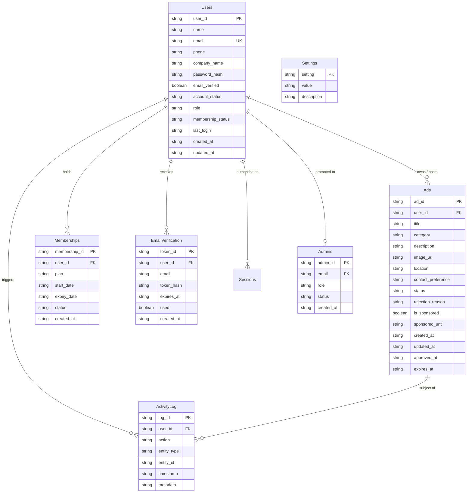

# Google Sheets Data Model: FreeAds Post

**Version:** 1.0.0  
**Status:** Frozen Data Model  
**Storage Medium:** Google Sheets (Single Spreadsheet)  
**Access Tier:** Internal Only via Google Apps Script (Never exposed directly to the browser)  

---

## 1. Global Data Model Design Principles

1. **Stable Business Identifiers**:
   * All entities use prefixed, unique random string identifiers (e.g., `usr_...`, `ad_...`, `mem_...`, `tok_...`, `adm_...`, `log_...`) generated via UUID/crypto random hex strings.
   * **Spreadsheet row numbers are never used as IDs**, ensuring row insertions, deletions, or sorting never break foreign-key references.
2. **Standard Timestamps**:
   * All datetime fields are stored in **ISO 8601 UTC format** (`YYYY-MM-DDTHH:mm:ss.sssZ`).
3. **Strict Privacy & Isolation**:
   * The spreadsheet is completely private to the project owner's Google account.
   * **Zero Google credentials or sheet IDs are placed in frontend client code.**
   * All reads and writes are mediated by the Google Apps Script API layer.
4. **Header Convention**:
   * Column names in Row 1 use exact `snake_case` corresponding to API data transfer objects.

---

## 2. Worksheets (Entities) Specification

The spreadsheet contains exactly eight (8) worksheets:
1. `Users`
2. `Ads`
3. `Memberships`
4. `EmailVerification`
5. `Admins`
6. `ActivityLog`
7. `Sessions`
8. `Settings`

---

### 2.1 Sheet: `Users`

Stores registered user profiles, authentication credentials, verification state, and membership status.

| Column | Field Name | Data Type | Required | Allowed Values / Pattern | Description |
| :--- | :--- | :--- | :--- | :--- | :--- |
| **A** | `user_id` | String | Yes | `usr_[a-f0-9]{16,32}` | Stable unique identifier (Primary Key) |
| **B** | `name` | String | Yes | Min 2, max 100 characters | Full personal or display name |
| **C** | `email` | String | Yes | Valid email (RFC 5322), lowercase | Unique login email address |
| **D** | `phone` | String | No | E.164 format or empty (e.g. `+1234567890`) | Contact phone number |
| **E** | `company_name` | String | No | Max 120 characters or empty | Registered business/company name |
| **F** | `password_hash` | String | Yes | `[a-f0-9]{64}:[a-f0-9]{32}` | Hashed password (`SHA256(password + salt):salt`) |
| **G** | `email_verified` | Boolean | Yes | `TRUE` \| `FALSE` | Email verification flag |
| **H** | `account_status` | String | Yes | `ACTIVE` \| `SUSPENDED` \| `BANNED` | Account operational status |
| **I** | `role` | String | Yes | `USER` \| `ADMIN` | Authorization role |
| **J** | `membership_status`| String | Yes | `FREE` \| `ACTIVE_MEMBER` \| `EXPIRED` | High-level membership cache |
| **K** | `last_login` | ISO 8601 | No | UTC timestamp or empty | Timestamp of last successful login |
| **L** | `is_logged_in` | Boolean | Yes | `TRUE` \| `FALSE` | Active login state indicator |
| **M** | `created_at` | ISO 8601 | Yes | UTC timestamp | Account registration timestamp |
| **N** | `updated_at` | ISO 8601 | Yes | UTC timestamp | Last profile update timestamp |

#### Users Validation Rules:
* `email`: Must be unique across all non-deleted rows. Case-insensitive normalization.
* `password_hash`: Plain-text passwords must never enter this column.
* `role`: Defaults to `USER`. Only authorized bootstrap or admin operations can set `ADMIN`.
* `membership_status`: Kept in sync with active records in the `Memberships` sheet.
* `is_logged_in`: Tracks active authenticated session state. Synchronized with the `Sessions` sheet to control public advertisement visibility.

---

### 2.2 Sheet: `Ads`

Stores classified advertisements, approval state, external image references, and priority placement attributes.

| Column | Field Name | Data Type | Required | Allowed Values / Pattern | Description |
| :--- | :--- | :--- | :--- | :--- | :--- |
| **A** | `ad_id` | String | Yes | `ad_[a-f0-9]{16,32}` | Stable unique ad identifier (Primary Key) |
| **B** | `user_id` | String | Yes | Foreign Key -> `Users.user_id` | Identifier of ad creator |
| **C** | `title` | String | Yes | Min 5, max 120 characters | Advertisement headline |
| **D** | `category` | String | Yes | Defined in `Settings.allowed_categories` | Category key (e.g. `VEHICLES`, `ELECTRONICS`) |
| **E** | `description` | String | Yes | Min 20, max 3000 characters | Detailed advertisement body |
| **F** | `image_url` | String | No | Valid `https://...` URL or empty | External HTTPS image URL (No file uploads) |
| **G** | `location` | String | Yes | Max 100 characters | City / Region / Area of the item or service |
| **H** | `contact_preference`| String| Yes | `EMAIL` \| `PHONE` \| `BOTH` | Preferred buyer contact channel |
| **I** | `status` | String | Yes | `PENDING` \| `APPROVED` \| `REJECTED` \| `EXPIRED` \| `DELETED` | Moderation & lifecycle state |
| **J** | `rejection_reason` | String | No | Max 500 characters or empty | Explanation provided by admin upon rejection |
| **K** | `is_sponsored` | Boolean | Yes | `TRUE` \| `FALSE` | Flag for priority/sponsored placement |
| **L** | `sponsored_until` | ISO 8601 | No | UTC timestamp or empty | Expiry timestamp for sponsored status |
| **M** | `created_at` | ISO 8601 | Yes | UTC timestamp | Ad submission timestamp |
| **N** | `updated_at` | ISO 8601 | Yes | UTC timestamp | Last ad modification timestamp |
| **O** | `approved_at` | ISO 8601 | No | UTC timestamp or empty | Timestamp when admin approved the ad |
| **P** | `expires_at` | ISO 8601 | Yes | UTC timestamp | Timestamp when ad ceases to display |

#### Ads Validation Rules:
* `status`:
  * Newly created ads MUST start as `PENDING`.
  * If an existing `APPROVED` ad is edited by a user, `status` MUST reset to `PENDING` and `approved_at` cleared.
  * Only ads with `status === 'APPROVED'` and `now < expires_at` can be returned to logged-in users.
* `image_url`:
  * Must match regex `^https://[^\s/$.?#].[^\s]*$` or be empty.
  * Server-side storage of image blobs is strictly prohibited.
* `is_sponsored`:
  * Can only be set to `TRUE` if the posting user possesses an active membership at submission, or if manually granted by an admin.
  * If `now > sponsored_until`, sponsored placement is ignored in queries.

---

### 2.3 Sheet: `Memberships`

Stores subscription plans, entitlement durations, and membership lifecycle records.

| Column | Field Name | Data Type | Required | Allowed Values / Pattern | Description |
| :--- | :--- | :--- | :--- | :--- | :--- |
| **A** | `membership_id` | String | Yes | `mem_[a-f0-9]{16,32}` | Stable unique identifier (Primary Key) |
| **B** | `user_id` | String | Yes | Foreign Key -> `Users.user_id` | Associated user identifier |
| **C** | `plan` | String | Yes | `BASIC_MEMBER` \| `PRO_SPONSOR` | Membership tier code |
| **D** | `start_date` | ISO 8601 | Yes | UTC timestamp | Plan activation date |
| **E** | `expiry_date` | ISO 8601 | Yes | UTC timestamp | Plan expiration date |
| **F** | `status` | String | Yes | `ACTIVE` \| `EXPIRED` \| `CANCELLED` | Current plan state |
| **G** | `created_at` | ISO 8601 | Yes | UTC timestamp | Record creation timestamp |

#### Memberships Validation Rules:
* A user may have multiple historical membership rows, but at most **one** with `status === 'ACTIVE'`.
* When `now > expiry_date`, `status` evaluates to `EXPIRED`.

---

### 2.4 Sheet: `EmailVerification`

Stores cryptographic one-time tokens for account activation and email validation.

| Column | Field Name | Data Type | Required | Allowed Values / Pattern | Description |
| :--- | :--- | :--- | :--- | :--- | :--- |
| **A** | `token_id` | String | Yes | `tok_[a-f0-9]{16,32}` | Stable unique token row ID (Primary Key) |
| **B** | `user_id` | String | Yes | Foreign Key -> `Users.user_id` | Associated user identifier |
| **C** | `email` | String | Yes | Valid email, lowercase | Email address pending verification |
| **D** | `token_hash` | String | Yes | `[a-f0-9]{64}` | `SHA256(raw_verification_token)` |
| **E** | `expires_at` | ISO 8601 | Yes | UTC timestamp | Token expiry (default 24 hours) |
| **F** | `used` | Boolean | Yes | `TRUE` \| `FALSE` | Token redemption status |
| **G** | `created_at` | ISO 8601 | Yes | UTC timestamp | Token creation timestamp |

#### EmailVerification Validation Rules:
* `token_hash`: The raw token sent to the user's email is never stored directly in the sheet. Only its SHA-256 hash is recorded.
* A token is invalid if `used === TRUE` or `now > expires_at`.
* Upon successful verification, `used` is set to `TRUE` and `Users.email_verified` is set to `TRUE`.

---

### 2.5 Sheet: `Admins`

Stores designated administrative operators authorized to moderate ads and manage memberships.

| Column | Field Name | Data Type | Required | Allowed Values / Pattern | Description |
| :--- | :--- | :--- | :--- | :--- | :--- |
| **A** | `admin_id` | String | Yes | `adm_[a-f0-9]{16,32}` | Stable unique admin identifier (Primary Key)|
| **B** | `email` | String | Yes | Valid email, lowercase | Admin account email (Matches `Users.email`)|
| **C** | `role` | String | Yes | `SUPER_ADMIN` \| `MODERATOR` | Administrative authority tier |
| **D** | `status` | String | Yes | `ACTIVE` \| `INACTIVE` | Admin status flag |
| **E** | `created_at` | ISO 8601 | Yes | UTC timestamp | Admin appointment timestamp |

#### Admins Validation Rules:
* `email`: Must correspond to an existing record in `Users`.
* All admin actions check `status === 'ACTIVE'` before authorizing moderation or user management endpoints.

---

### 2.6 Sheet: `ActivityLog`

Stores an immutable audit trail of critical system actions for security, compliance, and dispute resolution.

| Column | Field Name | Data Type | Required | Allowed Values / Pattern | Description |
| :--- | :--- | :--- | :--- | :--- | :--- |
| **A** | `log_id` | String | Yes | `log_[a-f0-9]{16,32}` | Stable unique log identifier (Primary Key) |
| **B** | `user_id` | String | No | Foreign Key -> `Users.user_id` or `SYSTEM` | User who initiated the action |
| **C** | `action` | String | Yes | Standard action verb (see list below) | High-level action identifier |
| **D** | `entity_type` | String | Yes | `USER` \| `AD` \| `MEMBERSHIP` \| `TOKEN` | Entity type being operated upon |
| **E** | `entity_id` | String | Yes | Identifier of target entity | Target primary key |
| **F** | `timestamp` | ISO 8601 | Yes | UTC timestamp | Exact time of event |
| **G** | `metadata` | String | No | Valid JSON string or empty | Structured payload of changes or context |

#### Standard Action Verbs:
* `USER_REGISTER`, `USER_VERIFY_EMAIL`, `USER_LOGIN`, `USER_SUSPEND`
* `AD_CREATE`, `AD_UPDATE`, `AD_APPROVE`, `AD_REJECT`, `AD_DELETE`
* `MEMBERSHIP_ACTIVATE`, `MEMBERSHIP_EXPIRE`, `MEMBERSHIP_CANCEL`

---

### 2.7 Sheet: `Sessions`

Stores active authenticated user sessions, indexed by hashed token with strict expiry tracking and server-side revocation on logout.

| Column | Field Name | Data Type | Required | Allowed Values / Pattern | Description |
| :--- | :--- | :--- | :--- | :--- | :--- |
| **A** | `session_id` | String | Yes | `ses_[a-f0-9]{16,32}` | Stable unique session identifier (Primary Key) |
| **B** | `token_hash` | String | Yes | `[a-f0-9]{64}` | SHA-256 hash of high-entropy 64-char random session token |
| **C** | `user_id` | String | Yes | `usr_[a-f0-9]{16,32}` | Reference to `Users.user_id` (Foreign Key) |
| **D** | `role` | String | Yes | `USER`, `ADMIN`, `SUPER_ADMIN` | Authenticated role snapshot at session creation |
| **E** | `expires_at` | String | Yes | ISO 8601 UTC timestamp | Expiration timestamp (default: `now + 7 days`) |
| **F** | `created_at` | String | Yes | ISO 8601 UTC timestamp | Session generation timestamp |

---

### 2.8 Sheet: `Settings`

Stores key-value platform configuration parameters that can be updated dynamically by administrators without modifying backend code.

| Column | Field Name | Data Type | Required | Allowed Values / Pattern | Description |
| :--- | :--- | :--- | :--- | :--- | :--- |
| **A** | `setting` | String | Yes | Lowercase alphanumeric with underscores (e.g. `site_name`) | Configuration parameter key (Primary Key) |
| **B** | `value` | String | Yes | String or JSON-encoded object | Current configuration parameter value |
| **C** | `description` | String | No | Free text explanation | Documentation of parameter purpose and impact |

#### Standard Default Settings Values:

| Setting Key | Default Value | Description |
| :--- | :--- | :--- |
| `site_name` | `FreeAds Post` | Public display name in UI and emails |
| `default_ad_duration_days` | `30` | Duration an approved ad remains visible |
| `verification_token_expiry_hours` | `24` | Lifetime in hours for registration verification links |
| `session_expiry_days` | `7` | Lifetime in days for user session tokens |
| `allowed_categories` | `["Services", "Vehicles", "Electronics", "Real Estate", "Jobs", "Community", "Buy & Sell"]` | JSON array of valid advertisement categories |
| `require_email_verification` | `true` | When true, users cannot log in without verified email |
| `max_ads_per_free_user` | `5` | Maximum active ads permitted for free tier accounts |
| `admin_notification_email` | `admin@example.com` | Email destination for pending ad notifications |
| `inactivity_warning_days` | `60` | Days of user inactivity before an advance warning notification is sent |
| `inactivity_hide_ad_days` | `90` | Days of user inactivity before approved ads are automatically paused |

---

## 3. Entity Relationships (ER Diagram)



---

## 4. Query & Concurrency Optimization in Google Sheets

1. **Transactional Locking (`LockService`)**:
   * All mutations (`INSERT`, `UPDATE`, `DELETE`) across `Users`, `Ads`, `Memberships`, `EmailVerification`, and `ActivityLog` acquire a Google Apps Script document lock:
     ```javascript
     const lock = LockService.getScriptLock();
     lock.waitLock(15000); // 15 seconds max wait
     try {
       // Perform spreadsheet read-modify-write
     } finally {
       lock.releaseLock();
     }
     ```
2. **In-Memory Row Mapping**:
   * Sheet operations fetch `sheet.getDataRange().getValues()` once per request to avoid multi-call quota latency.
   * Lookups by Primary Key (`user_id`, `ad_id`, etc.) build a quick key-to-row map in memory.
3. **Feed Filtering & Sponsored Sorting**:
   * Logged-in feed reads query `Ads`:
     * Filter: `status === 'APPROVED' && now < expires_at`.
     * Sort Order:
       1. `is_sponsored === TRUE && (sponsored_until == null || now < sponsored_until)` (First)
       2. `created_at DESC` (Newest first)

---

## 5. Security Architecture & Threat Model

* **No Direct Browser Access**: Google Sheets access permissions are set to "Restricted" (only the Google Apps Script script owner has access). The sheet is **NEVER** shared with "Anyone with the link".
* **No Frontend Credentials**: No Google API keys, OAuth client secrets, or Service Account credentials exist anywhere in the frontend codebase. The frontend communicates solely with the published Google Apps Script Web App exec URL.
* **Credentials Isolation**: Plain-text passwords are encrypted/hashed via salted SHA-256 before any row is written.
* **Raw Tokens Never Stored**: Email verification tokens and session tokens are transmitted as high-entropy one-time random strings; the spreadsheet stores only their SHA-256 hashes (`token_hash`).

---

*Google Sheets Data Model is frozen and documented.*
